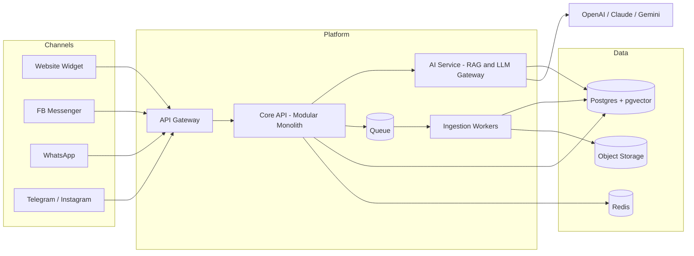

# 01 — Executive Summary

## সারসংক্ষেপ (বাংলায়)

আমরা একটি Multi-Tenant **AI Agent Operating System** তৈরি করব — যেখানে যেকোনো কোম্পানি কোড ছাড়াই একাধিক AI Agent তৈরি, ট্রেন এবং Website, Facebook Messenger, WhatsApp-সহ বিভিন্ন চ্যানেলে ডিপ্লয় করতে পারবে। এটি Chatbot Builder নয় — দীর্ঘমেয়াদে এটি একটি **AI Workforce Platform**, যেখানে Agent শুধু প্রশ্নের উত্তর দেবে না, ব্যবসায়িক কাজও (Order Collection, Lead Capture, Stock Check) সম্পন্ন করবে।

এই ডকুমেন্ট সেটে আমরা BRD-এর পাঁচটি প্রশ্নের জবাব দিয়েছি:

1. **World-class SaaS Architecture** → [02-system-architecture.md](02-system-architecture.md)
2. **Scalability (১০,০০০+ কোম্পানি)** → [02-system-architecture.md](02-system-architecture.md) (Scalability section)
3. **Security ও Data Isolation** → [03-multi-tenancy-security.md](03-multi-tenancy-security.md)
4. **AI Agent Lifecycle** → [04-agent-lifecycle.md](04-agent-lifecycle.md)
5. **Differentiating Features** → [08-differentiators.md](08-differentiators.md)

---

## Product Positioning

| | Chatbot Builder | আমাদের Platform |
|---|---|---|
| Unit of value | একটি Bot | একটি **Digital Employee (Agent)** |
| Interaction | Question → Answer | Question → **Reasoning → Action** → Answer |
| Knowledge | Static FAQ | Living Knowledge Base + Smart Retraining + Learning Loop |
| Channel | সাধারণত একটি | Omnichannel — এক Agent, সব চ্যানেল |
| Tenancy | Single workspace | Organization → Workspace → Agents hierarchy |
| Pricing | Message-based | **Agent-count based** (Starter 1 / Growth 5 / Business 20 / Enterprise unlimited) |

**Category:** AI Workforce Platform। তুলনীয় Global Products: Intercom Fin, Chatbase, Voiceflow — কিন্তু আমাদের Wedge হলো **Bangla-native AI + Facebook-centric Commerce + COD Workflow** ([08-differentiators.md](08-differentiators.md))।

---

## মূল Architecture সিদ্ধান্ত (TL;DR)

এগুলোর বিস্তারিত যুক্তি সংশ্লিষ্ট ডকুমেন্টে আছে; এখানে শুধু সিদ্ধান্ত:

1. **Modular Monolith first, Microservices পরে।** Core API একটি Modular Monolith (NestJS); শুধু AI/RAG Pipeline আলাদা Python Service। ১০ জনের কম টিমে Microservices শুরু করা আত্মঘাতী — কিন্তু Module Boundary এমনভাবে কাটা হবে যেন পরে Service হিসেবে Extract করা যায়। → [02](02-system-architecture.md)

2. **Shared Postgres + Row-Level Security (RLS) দিয়ে Tenant Isolation।** প্রতিটি Row-এ `org_id`; Database নিজেই Cross-tenant Access ব্লক করবে — Application Bug হলেও Data Leak হবে না। Enterprise Client-এর জন্য Dedicated Database/Region option। → [03](03-multi-tenancy-security.md)

3. **Vector Database = pgvector (শুরুতে)।** আলাদা Vector DB চালানোর Operational খরচ এড়াতে Postgres-এর ভেতরেই pgvector; প্রতি Agent আলাদা Namespace। Scale trigger ছুঁলে Qdrant-এ Migration — Abstraction Layer আগে থেকেই থাকবে। → [05](05-tech-stack.md)

4. **Model-Agnostic LLM Gateway।** আমরা নিজের Model বানাব না। একটি Internal Gateway (Adapter Pattern) — Customer বেছে নেবে OpenAI / Claude / Gemini; নতুন Model যোগ করা মানে শুধু নতুন Adapter। → [05](05-tech-stack.md)

5. **Queue-driven Knowledge Ingestion, Day 1 থেকে।** Document Upload → Queue → Worker (Parse, Chunk, Embed, Index)। Synchronous Processing কখনোই না — এটাই ১০,০০০ Tenant-এ Scale করার পূর্বশর্ত। → [02](02-system-architecture.md), [04](04-agent-lifecycle.md)

6. **Channel Priority: Website Widget + Facebook Messenger আগে; WhatsApp Phase 2।** বাংলাদেশের ৮০% SME Facebook-এ ব্যবসা করে — Messenger তাদের কাছে পৌঁছানোর পথ; Website Widget সবচেয়ে কম Friction-এ Global-ready। WhatsApp Business API-র BSP cost ও Approval Friction-এর কারণে Phase 2। → [06](06-channels-gtm.md)

7. **Tech Stack: TypeScript Core + Python AI Service।** Next.js (Dashboard + Widget), NestJS (Core API), FastAPI (AI/RAG), Postgres + pgvector, Redis + BullMQ, S3-compatible Storage। → [05](05-tech-stack.md)

---

## High-Level Architecture (এক নজরে)

---

## Risk Summary

| Risk | Mitigation |
|---|---|
| LLM cost margin খেয়ে ফেলা | Agent-count pricing + Usage cap + Model tiering (সস্তা Model default, দামি Model premium) |
| WhatsApp/Meta API policy পরিবর্তন | Channel Adapter Layer — এক চ্যানেল বন্ধ হলেও Core অক্ষত |
| Bangla LLM quality | Bangla Eval Suite + Model benchmarking ([08](08-differentiators.md)) |
| Premature scaling | Modular Monolith + ডকুমেন্টেড extraction trigger ([02](02-system-architecture.md)) |
| Data leak (cross-tenant) | DB-level RLS + Automated isolation tests ([03](03-multi-tenancy-security.md)) |

---

## পরবর্তী পদক্ষেপ

[07-roadmap.md](07-roadmap.md) অনুযায়ী **Phase 0 (MVP, ৩–৪ মাস)** অনুমোদন: ১টি Agent Type (Support/Knowledge), Document Upload → Auto-train, Website Widget + Messenger Deploy, Basic Dashboard।
