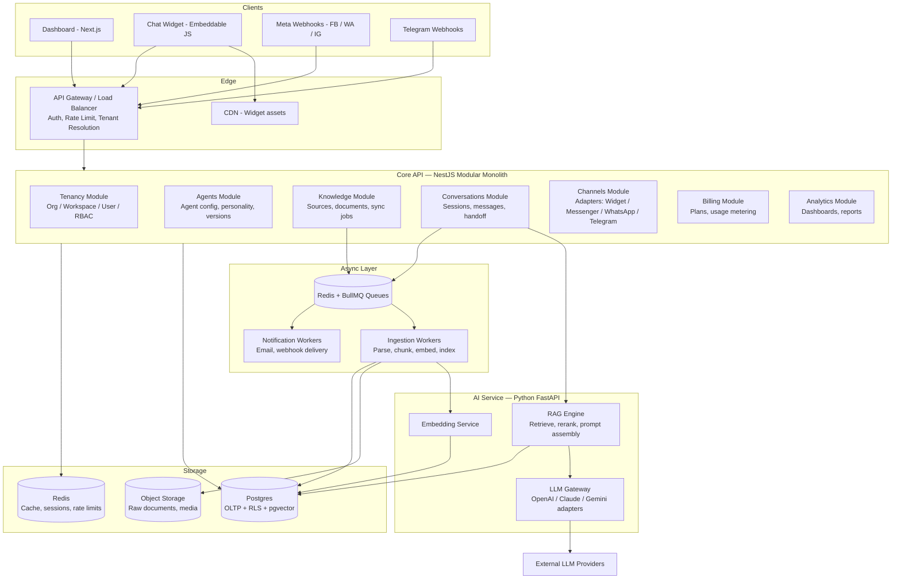
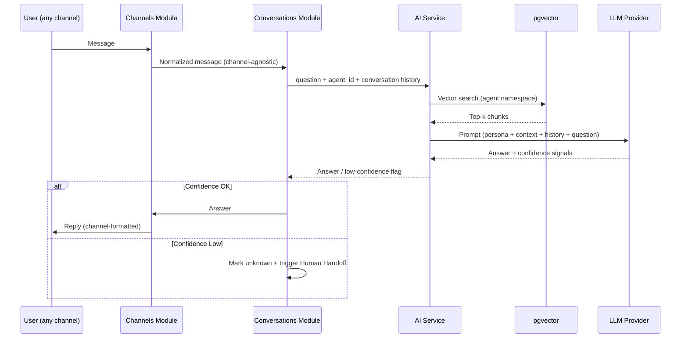
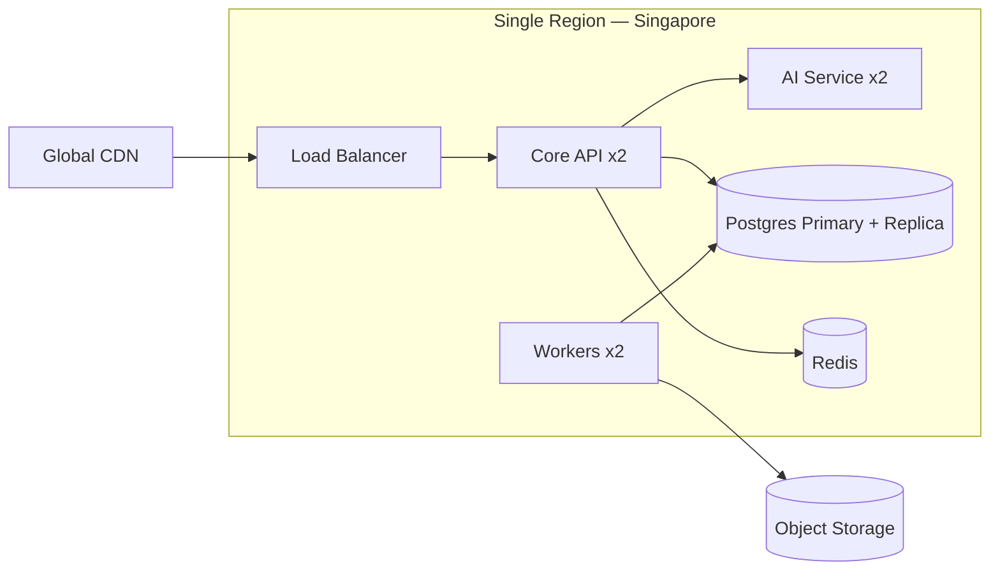

# 02 — System Architecture

## সারসংক্ষেপ (বাংলায়)

আমরা শুরু করব একটি **Modular Monolith** Core API দিয়ে, পাশে একটি আলাদা **Python AI Service** — কারণ AI Workload (Embedding, RAG, LLM call) এবং Business Logic (Billing, RBAC, Channel Management)-এর Scaling Profile সম্পূর্ণ আলাদা। সব Heavy কাজ (Document Processing, Broadcast, Webhook Delivery) যাবে **Queue** দিয়ে। প্রতিটি Component Stateless — তাই Horizontal Scaling মানে শুধু Instance বাড়ানো। এই ডিজাইনে ১০,০০০+ Tenant পর্যন্ত যাওয়া যাবে Architecture না পাল্টে — শুধু Infrastructure বাড়িয়ে।

---

## 1. Architecture Style: কেন Modular Monolith?

তিনটি Option বিবেচনা করা হয়েছে:

| Option | সুবিধা | অসুবিধা | রায় |
|---|---|---|---|
| Pure Monolith | সবচেয়ে সহজ | AI Workload আলাদাভাবে Scale করা যায় না; Python ecosystem ব্যবহার করা যায় না | ❌ |
| Full Microservices | Independent scaling, team autonomy | ছোট টিমে Operational overhead মারাত্মক; Distributed debugging; Premature complexity | ❌ |
| **Modular Monolith + 1 AI Service** | সহজ Operations, কিন্তু AI আলাদা Scale হয়; Module boundary পরে Service হবে | Boundary discipline লাগবে | ✅ |

**নিয়ম:** Core API-এর ভেতরে প্রতিটি Module (Tenancy, Agents, Knowledge, Conversations, Channels, Billing, Analytics) নিজের Database Table-গুলোর মালিক; এক Module আরেক Module-এর Table সরাসরি Query করবে না — Internal Interface দিয়ে কথা বলবে। এতে ভবিষ্যতে যেকোনো Module-কে আলাদা Service বানানো যাবে।

**Extraction Triggers** (কখন কোন Module আলাদা Service হবে):

- **Channels Module** → যখন Webhook traffic > Core API traffic-এর ৩ গুণ
- **Analytics Module** → যখন Reporting query OLTP-কে slow করে (তখন আলাদা OLAP store: ClickHouse)
- **Conversations Module** → যখন Concurrent chat session > ~৫০k

---

## 2. Component Architecture

### Component দায়িত্ব

**API Gateway / Edge**
- প্রতিটি Request-এ Tenant Resolution (API key / JWT / Webhook signature থেকে `org_id` বের করা)
- Rate Limiting — per-tenant এবং per-plan (Redis-backed)
- Widget asset CDN থেকে serve হবে (Core-এ load পড়বে না)

**Core API (NestJS)** — সব Business Logic। Stateless; যেকোনো সংখ্যক Replica।

**AI Service (FastAPI)** — Stateless RAG Engine। Conversation-এর প্রতিটি Answer এখান থেকে:

**Async Layer** — Document ingestion কখনো Request path-এ হবে না। বিস্তারিত pipeline: [04-agent-lifecycle.md](04-agent-lifecycle.md)।

---

## 3. Scalability Design: ১০,০০০+ Tenant

### 3.1 Scaling-এর মূলনীতি

1. **সব Service Stateless** — Session state Redis-এ, file S3-তে। Scale = replica বাড়ানো।
2. **Workload Class আলাদা করা** — Chat (latency-sensitive), Ingestion (throughput-sensitive), Webhook (bursty)। প্রতিটির আলাদা Worker pool ও Queue, যেন এক কোম্পানির ৫০০ MB PDF upload আরেক কোম্পানির Chat slow না করে।
3. **Tenant Fairness** — Per-tenant Queue concurrency cap + Rate limit। একটি Tenant কখনো পুরো System-এর ক্ষমতা দখল করতে পারবে না (noisy neighbor problem)।

### 3.2 Capacity Model (১০,০০০ Tenant-এ আনুমানিক)

| Metric | Assumption | Implication |
|---|---|---|
| Active tenants | 10,000 | Avg 3 agents each → 30,000 agents |
| Conversations/day | ~50/tenant → 500k/day | Peak ~৫০ msg/sec — কয়েকটি Core replica-তেই সম্ভব |
| LLM calls | 500k–1M/day | Bottleneck আমাদের নয়, Provider rate limit — multi-key + multi-provider pooling |
| Vector data | ~2k chunks/agent → 60M vectors | pgvector-এর সীমার ভেতরে partitioning সহ; এর বেশি হলে Qdrant ([05](05-tech-stack.md)) |
| Documents | ~200/tenant → 2M files | S3 — কোনো সমস্যা নেই |

### 3.3 Layer-by-layer Scaling Path

| Layer | Day 1 | Growth (1k tenants) | Scale (10k tenants) |
|---|---|---|---|
| Core API | 2 replicas | Auto-scaling 3–10 | Module extraction শুরু (trigger অনুযায়ী) |
| AI Service | 2 replicas | Auto-scaling, provider key pool | Region-wise deployment |
| Postgres | 1 primary + 1 replica | Read replicas, PgBouncer | Partitioning (`org_id` hash); বড় tenant আলাদা DB-তে move |
| Vector | pgvector | pgvector + HNSW index, partition per shard | Qdrant cluster migration |
| Queue | Redis + BullMQ | Dedicated Redis, queue per workload class | Kafka বিবেচনা (শুধু প্রয়োজনে) |
| Analytics | Postgres queries | Materialized views | ClickHouse + event stream |

### 3.4 Caching Strategy

- **Agent config + persona prompt** → Redis (TTL + invalidation on update)। প্রতি Message-এ DB hit নয়।
- **Embedding cache** — একই Text-এর Embedding আবার generate না করা (content hash key)।
- **Conversation history** — সাম্প্রতিক N message Redis-এ; পুরোটা Postgres-এ।
- **Semantic answer cache (পরে)** — হুবহু এক প্রশ্নের cached উত্তর; LLM cost কমাবে।

### 3.5 Availability

- Multi-AZ deployment; DB automated failover
- Queue-backed retry with exponential backoff (LLM provider outage হলে message হারাবে না)
- LLM provider fallback chain: Primary fail → Secondary provider (LLM Gateway-তে built-in, [05](05-tech-stack.md))
- Target: 99.9% uptime (MVP) → 99.95% (Enterprise tier)

---

## 4. API Design Principles

- **REST + JSON** public API; Dashboard-এর জন্য একই API (dogfooding)
- সব API **tenant-scoped**: token নিজেই org/workspace context বহন করে — URL-এ tenant id পাঠিয়ে spoofing-এর সুযোগ নেই
- **Webhook out** — customer-এর system-এ event পাঠানো (lead captured, handoff requested) — Day 1 থেকে designed, পরে exposed
- **Idempotency keys** — সব write API-তে (channel retry-safe)
- Public API versioning: `/v1/...`

---

## 5. Deployment Topology (MVP)

- **Region: Singapore (ap-southeast-1)** — বাংলাদেশ থেকে ~৫০–৭০ms; Managed services সম্পূর্ণ available। বিস্তারিত hosting analysis: [05-tech-stack.md](05-tech-stack.md)
- Containerized (Docker) day 1; orchestration শুরুতে managed container service, পরে Kubernetes — তখনই, যখন একাধিক service/team হবে
- IaC (Terraform) day 1 — region replication ও Enterprise data residency ([03](03-multi-tenancy-security.md)) সহজ হবে

---

## 6. Observability

| Concern | Tool/Approach |
|---|---|
| Logs | Structured JSON, সব log-এ `org_id` + `agent_id` + `trace_id` |
| Tracing | OpenTelemetry — এক message-এর পুরো পথ (channel → core → AI → LLM) এক trace-এ |
| Metrics | প্রতি tenant: token usage, latency, answer rate, handoff rate — এগুলোই আবার Billing metering ও Owner Dashboard-এর data |
| LLM observability | প্রতিটি LLM call log: prompt version, model, tokens, cost, latency — cost attribution per tenant |
| Alerting | Error rate, queue depth, LLM provider failure, per-tenant cost anomaly |
