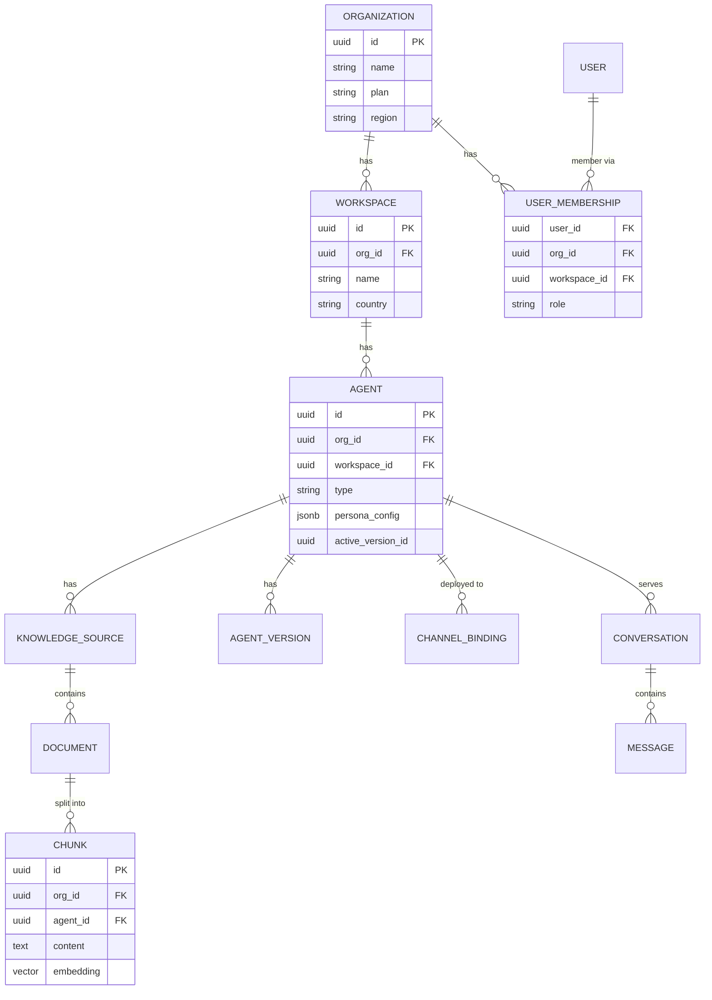

# 03 — Multi-Tenancy & Security Design

## সারসংক্ষেপ (বাংলায়)

প্ল্যাটফর্মের Tenancy Model তিন স্তরের: **Organization → Workspace → Agent**। Data Isolation-এর ভিত্তি হলো Shared Postgres-এ **Row-Level Security (RLS)** — প্রতিটি Row-এ `org_id` থাকবে এবং Database নিজেই নিশ্চিত করবে যে এক কোম্পানির Query আরেক কোম্পানির Data ছুঁতে পারবে না, এমনকি Application Code-এ Bug থাকলেও। Enterprise Client-এর জন্য Dedicated Database ও Data Residency option থাকবে। RBAC, Audit Log এবং Secrets Management Day 1 থেকে Schema-তে designed থাকবে।

---

## 1. Tenancy Data Model



মূল নিয়মগুলো:

- **প্রতিটি Table-এ `org_id` থাকবে** — এমনকি যেখানে Parent দিয়ে derive করা যেত সেখানেও (denormalized)। কারণ: RLS Policy সরাসরি apply করা যায়, JOIN লাগে না।
- **Workspace** হলো Regional/Departmental বিভাজন (Bangladesh / Dubai / India) — Billing Org-level, Permission Workspace-level পর্যন্ত নামানো যায়।
- **Agent** সবসময় একটি Workspace-এর ভেতরে। Knowledge, Channel Binding, Conversation — সব Agent-scoped।
- Pricing enforcement সহজ: `COUNT(agents WHERE org_id = X) <= plan.agent_limit`।

---

## 2. Data Isolation Strategy

### 2.1 তিনটি Model-এর তুলনা

| Model | Isolation | Cost/tenant | Operations | কার জন্য |
|---|---|---|---|---|
| Shared DB + RLS | Strong (DB-enforced) | খুব কম | এক DB cluster | **Default — সব Self-serve tier** |
| Dedicated Schema | Stronger | মাঝারি | Migration জটিল (n schemas) | প্রয়োজন নেই (skip) |
| Dedicated DB / Region | Strongest + Residency | বেশি | আলাদা provisioning | **Enterprise add-on** |

**সিদ্ধান্ত:** Shared DB + RLS default; Dedicated DB শুধু Enterprise-এ। Dedicated Schema মাঝামাঝি option হিসেবে complexity বাড়ায় কিন্তু value কম — বাদ।

### 2.2 RLS কীভাবে কাজ করবে

প্রতিটি Request-এ API Gateway → Core API tenant context resolve করে DB session-এ set করবে:

```sql
-- প্রতিটি tenant-scoped table-এ:
ALTER TABLE agents ENABLE ROW LEVEL SECURITY;

CREATE POLICY tenant_isolation ON agents
    USING (org_id = current_setting('app.current_org_id')::uuid);

-- Request শুরুতে (connection/transaction-scoped):
SET LOCAL app.current_org_id = '<resolved org id>';
```

- Application DB user-এর `BYPASSRLS` থাকবে না।
- কোনো Developer ভুলে `WHERE org_id = ...` বাদ দিলেও — query অন্য tenant-এর row **দেখতেই পাবে না**। এটাই defense-in-depth-এর মূল স্তর।
- **Vector search-ও RLS-এর আওতায়** — `chunks` table-এ `org_id` + `agent_id` দুটোই আছে; retrieval সবসময় `agent_id` filter-সহ। এক Agent-এর জ্ঞান আরেক Agent-এ leak হবে না (একই কোম্পানির ভেতরেও — HR Agent-এর Data Sales Agent দেখবে না)।

### 2.3 Isolation Verification (অবশ্য করণীয়)

- **Automated cross-tenant test suite** — CI-তে প্রতি build: Tenant A-এর token দিয়ে Tenant B-এর প্রতিটি resource access করার চেষ্টা; সব 404/403 হতে হবে।
- RLS policy coverage check: নতুন table-এ policy না থাকলে migration fail।
- Penetration test — public launch-এর আগে external audit।

### 2.4 Data Residency (Enterprise)

- Org-level `region` field; Enterprise org provision হবে নির্দিষ্ট region-এর DB + Object Storage-এ।
- Terraform module দিয়ে region stack reproducible ([02](02-system-architecture.md) §5)।
- LLM call-এর ক্ষেত্রে region-pinned provider endpoint ব্যবহার (যেমন: EU client → EU-hosted model endpoint) — Enterprise contract-এ উল্লেখযোগ্য selling point।

---

## 3. RBAC (Role-Based Access Control)

### 3.1 Roles

| Role | Scope | ক্ষমতা |
|---|---|---|
| **Owner** | Organization | সব + Billing + Org delete + Member management |
| **Admin** | Organization | সব (Billing ও Org delete ছাড়া) |
| **Manager** | Workspace | Workspace-এর Agent create/edit/deploy, Knowledge manage, Learning loop answer |
| **Agent Manager** | নির্দিষ্ট Agent(s) | Assigned agent-এর Knowledge + config + conversations |
| **Viewer** | Org বা Workspace | Read-only: dashboard, reports, conversations |

### 3.2 Design

- Permission check **Resource + Action + Scope** model-এ: `can(user, 'agent:edit', agent)` — role থেকে permission set derive হবে (hard-coded role check নয়), যেন পরে Custom Roles (Enterprise feature) যোগ করা যায়।
- Membership table-এ `workspace_id` nullable — null মানে Org-wide role।
- **Human Handoff Inbox**-এর জন্য আলাদা lightweight permission (`conversation:reply`) — Support team member-দের পুরো Manager role দিতে হবে না।

---

## 4. Audit Logs

**কে, কী, কখন, কোথা থেকে** — append-only table:

```text
audit_logs:
  id, org_id, actor_user_id, actor_type (user/system/api_key),
  action (agent.created, knowledge.uploaded, member.role_changed,
          agent.deployed, conversation.handoff, settings.updated, ...),
  resource_type, resource_id,
  metadata (jsonb — before/after diff for sensitive changes),
  ip_address, user_agent, created_at
```

- Application-level emit — প্রতিটি mutation service-এ audit emit বাধ্যতামূলক (interceptor দিয়ে স্বয়ংক্রিয়)।
- Append-only: UPDATE/DELETE permission নেই কারো।
- Dashboard-এ Org Admin দেখতে পাবে (Enterprise: export + SIEM webhook)।
- Retention: Standard 90 দিন, Enterprise configurable।

---

## 5. Secrets & Key Management

| Secret | Handling |
|---|---|
| Customer-এর BYO LLM API key (Enterprise) | Envelope encryption (KMS master key + per-org data key); plaintext কখনো log/DB-তে নয় |
| Platform LLM keys | Secret manager (cloud KMS-backed); per-environment আলাদা; rotation policy |
| Channel tokens (FB Page token, WhatsApp token) | Encrypted at rest, একই envelope pattern |
| Widget embed key | Public identifier + domain allowlist (origin check) — secret নয় |
| Webhook signing | প্রতি org-এর আলাদা signing secret; সব outbound webhook HMAC-signed |

---

## 6. AI-Specific Security

এগুলো সাধারণ SaaS checklist-এর বাইরে — AI platform-এর নিজস্ব ঝুঁকি:

1. **Prompt Injection** — Customer-এর document বা end-user-এর message-এ "ignore your instructions" জাতীয় আক্রমণ।
   - System prompt-এ স্পষ্ট boundary; retrieved content সবসময় "untrusted context" হিসেবে delimiter-wrapped।
   - Agent-এর tool/action execution (future phase) allowlist-based — model নিজে নতুন capability পাবে না।

2. **Cross-agent knowledge leak** — Retrieval সবসময় `agent_id`-scoped (উপরে §2.2)। Agent-to-agent shared knowledge ভবিষ্যতে explicit opt-in feature হবে, default নয়।

3. **PII in conversations** — End-user-রা phone, address দেবে (বিশেষত COD workflow-তে)।
   - Conversation data encryption at rest; field-level masking Viewer role-এ (configurable)।
   - LLM provider-এ পাঠানো data: provider-এর zero-retention / no-training option ব্যবহার এবং DPA সই — Enterprise sales-এ লাগবেই।

4. **Output safety** — Agent-এর উত্তরে competitor-এর URL, ভুল দাম, hallucinated policy যেন না যায়: RAG-only answer mode (knowledge-এর বাইরে গেলে "জানি না" + handoff), বিস্তারিত [04](04-agent-lifecycle.md)।

5. **Abuse / cost attack** — Public widget-এ bot flooding → per-session + per-IP rate limit, CAPTCHA escalation, per-org daily LLM budget cap।

---

## 7. Compliance Roadmap

| ধাপ | কী |
|---|---|
| MVP | TLS everywhere, encryption at rest, RLS, audit log, backup + restore drill |
| Growth | SOC 2 Type I প্রস্তুতি (policy + evidence collection শুরু), GDPR-ready data deletion (org delete = সব data purge, S3-সহ) |
| Enterprise | SOC 2 Type II, DPA template, data residency, SSO (SAML/OIDC), SCIM |
