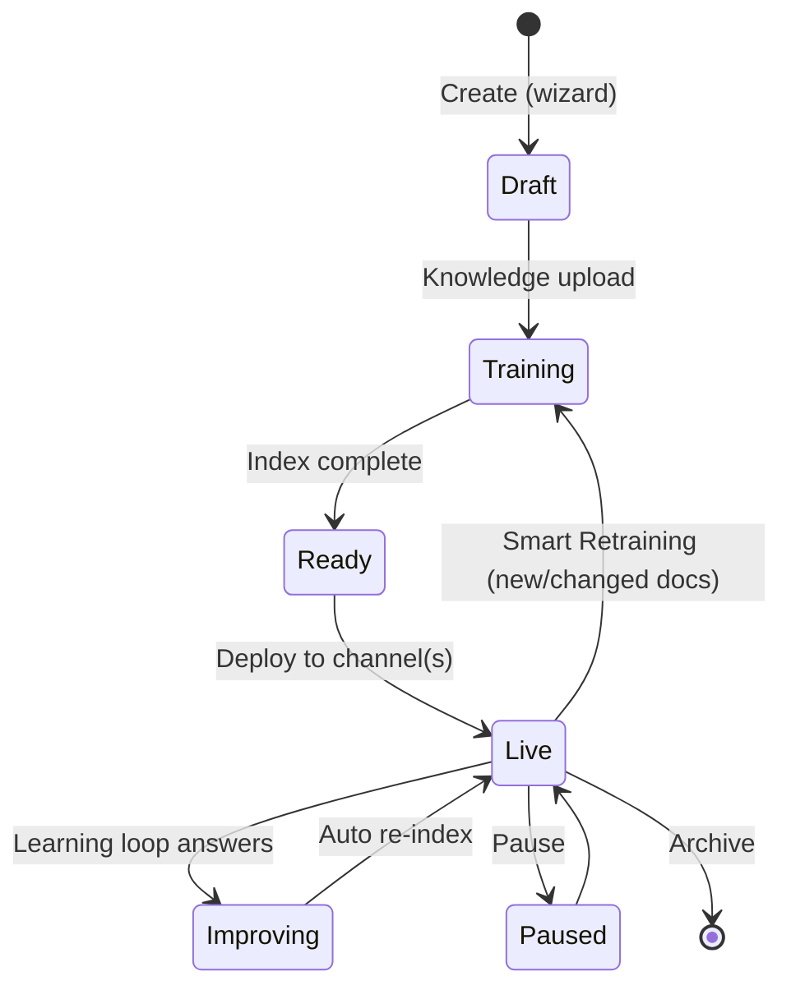
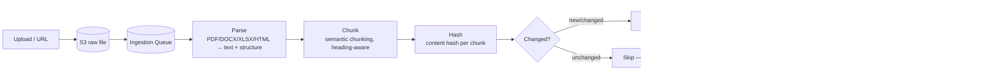
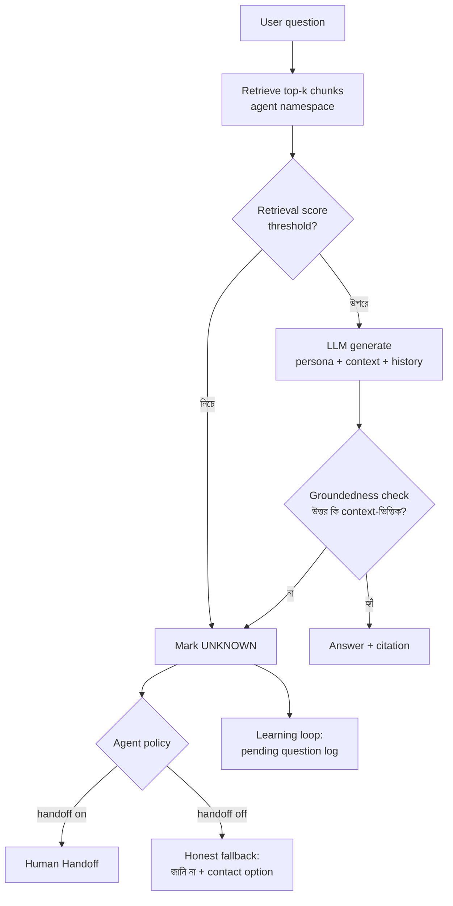
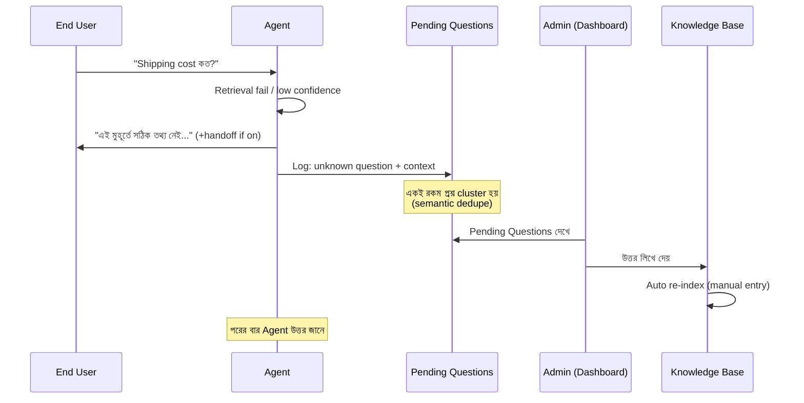

# 04 — AI Agent Lifecycle: Create → Train → Deploy → Improve

## সারসংক্ষেপ (বাংলায়)

এই ডকুমেন্ট প্ল্যাটফর্মের Heart — একটি Agent কীভাবে জন্ম নেয়, শেখে, কাজে নামে এবং প্রতিদিন আরও ভালো হয়। মূল উপাদান: **Knowledge Ingestion Pipeline** (Upload → Parse → Chunk → Embed → Index), **Smart Retraining** (নতুন Document দিলে শুধু পরিবর্তিত অংশ Re-index), **Learning Loop** (Agent যা পারে না তা Admin-কে দেখানো, উত্তর দিলে Agent শিখে যায়), এবং **Confidence-based Human Handoff**। প্রতিটি Agent-এর Knowledge Versioned — সমস্যা হলে আগের Version-এ Rollback করা যাবে।

---

## 1. Lifecycle Overview



---

## 2. Create — Agent Creation Wizard

BRD-এর ৬-step journey-কে আমরা এভাবে implement করব:

| Step | UI | Backend |
|---|---|---|
| 1. Business Info | Company, Industry, Website, Language, Country | Org/Workspace metadata — পরে prompt-এ context হিসেবে যায় |
| 2. Agent Type | Sales / Support / Knowledge / Custom | **Agent Template** select — pre-tuned system prompt + suggested config (এটাই ভবিষ্যৎ Marketplace-এর বীজ) |
| 3. Knowledge Sources | PDF, DOCX, XLSX, CSV, Website URL, FAQ editor | Source registration → ingestion queue |
| 4. Personality | Professional / Friendly / Corporate / Technical / Luxury + language style (Bangla/English/Mixed) | Persona config (jsonb) → prompt assembly-তে ঢোকে |
| 5. Training | Progress UI (real-time) | Ingestion pipeline (নিচে §3) |
| 6. Deploy | Channel select + embed code / OAuth connect | Channel binding ([06](06-channels-gtm.md)) |

**Design সিদ্ধান্ত:** Agent-এর সব behavior এক jsonb `persona_config`-এ নয় — **versioned `agent_versions` table**-এ। প্রতিটি meaningful change (persona edit, knowledge re-index) নতুন version তৈরি করে; `active_version_id` pointer flip করলেই rollback।

---

## 3. Train — Knowledge Ingestion Pipeline



### Pipeline-এর গুরুত্বপূর্ণ সিদ্ধান্ত

1. **সবকিছু Async + Resumable** — প্রতিটি step আলাদা queue job; ৫০০ পাতার PDF-এর ৩০০ পাতায় fail করলে শুরু থেকে নয়, সেখান থেকে resume।
2. **Parsing quality-ই RAG quality** — Table-heavy document (Price list, Product catalog!) সাধারণ text extraction-এ নষ্ট হয়। Structured parser ব্যবহার (layout-aware); Excel/CSV-র জন্য row-level chunking যেন "X product-এর দাম কত" প্রশ্নে সঠিক row আসে।
3. **Chunking: heading-aware semantic chunking** — fixed-size নয়। প্রতিটি chunk-এ metadata: source document, page, section heading — উত্তরের সাথে **citation** দেখানো যাবে ("Source: pricelist.pdf, page 4") — trust builder।
4. **Website ingestion** — sitemap crawl + per-page hash; scheduled re-crawl (daily/weekly configurable) — এটিই website-এর Smart Retraining।
5. **FAQ / Manual entries** — DB-native structured knowledge (file নয়); Learning Loop-এর উত্তরগুলোও এখানেই জমা হয়।

### Knowledge Versioning

- প্রতিটি ingestion run = নতুন **knowledge version** (chunk-set snapshot pointer দিয়ে, data copy নয়)।
- Dashboard-এ version history: কবে কী upload, কত chunk বদলেছে।
- Rollback = active version pointer পেছনে নেওয়া। ভুল document upload করে Agent নষ্ট হলে এক ক্লিকে আগের অবস্থা।

---

## 4. Smart Retraining

BRD-এর সবচেয়ে গুরুত্বপূর্ণ দাবি: *"New PDF Upload → Auto Detect Changes → Re-index → Update Agent"*

**কীভাবে:** উপরের pipeline-এ Hash-diff step (§3 flowchart-এর `Changed?`) এটাই করে:

- নতুন file-এর প্রতিটি chunk-এর content hash পুরনো version-এর সাথে তুলনা
- শুধু নতুন/পরিবর্তিত chunk embed হয় (embedding cost ৯০%+ সাশ্রয়), মুছে যাওয়া chunk index থেকে retire হয়
- পুরো process-এ Agent **এক মুহূর্তও offline নয়** — নতুন version সম্পূর্ণ ready হলে atomic pointer flip

**Update-এর তিনটি পথ:**

| Trigger | উদাহরণ |
|---|---|
| Manual upload | Admin নতুন price list দিল |
| Scheduled re-crawl | Website প্রতি রাতে check হয় |
| API push (Growth phase) | Customer-এর system থেকে product feed sync (e-commerce integration) |

---

## 5. Deploy

- Channel binding তৈরি (Widget key / FB Page connect / WhatsApp number) — বিস্তারিত [06-channels-gtm.md](06-channels-gtm.md)
- Deploy-এর আগে **Playground**: Dashboard-এর ভেতরে Agent-এর সাথে test chat — যা live যাবে তার হুবহু পথ (same RAG, same prompt) — "এটা কি ready?" প্রশ্নের উত্তর দেখে নেওয়া যায়
- এক Agent একাধিক channel-এ; knowledge একটাই — শুধু channel adapter ভিন্নভাবে format করে (Messenger quick replies, WhatsApp buttons ইত্যাদি)

---

## 6. Answer Generation & Confidence

প্রতিটি উত্তরের মান নিয়ন্ত্রণের core logic:



- **RAG-only mode (default):** Knowledge-এ নেই এমন প্রশ্নে Agent বানিয়ে উত্তর দেবে না — "hallucinated দাম" ব্যবসার জন্য মারাত্মক। Honest "জানি না" + handoff/fallback।
- Confidence signal = retrieval score + groundedness check-এর সমন্বয় (একটি LLM self-check বা lightweight verifier)।
- Threshold per-agent configurable — Luxury brand চাইবে কঠোর, casual support নরম।

---

## 7. Improve — Agent Learning Loop



গুরুত্বপূর্ণ design point:

- **Semantic clustering** — "শিপিং খরচ কত", "ডেলিভারি চার্জ?", "কত টাকা লাগবে পাঠাতে" — এক cluster, Admin একবারই উত্তর দেবে। Cluster size = priority signal ("৪৭ জন এটা জিজ্ঞেস করেছে")।
- Admin-এর উত্তর = FAQ-type knowledge entry → স্বাভাবিক pipeline দিয়ে index → **কোনো আলাদা "retrain" বাটন নেই, শিখে যাওয়া automatic**।
- Negative feedback loop: End-user-এর 👎 reaction-ও pending review-তে আসে (ভুল উত্তর ধরা)।

---

## 8. Human Handoff

```text
AI চেষ্টা করে
   ↓ confidence low / user চাইলে ("আমি মানুষের সাথে কথা বলতে চাই") / policy trigger
Conversation status: ai_active → waiting_human
   ↓
Team Inbox-এ notification (dashboard + email/push)
   ↓
Human agent join করে — পুরো history + AI-র সংগ্রহ করা context সামনে
   ↓
Resolve হলে → ai_active-এ ফেরত (অথবা closed)
```

- Handoff trigger তিন রকম: **confidence-based** (auto), **user-requested** (intent detect), **rule-based** (যেমন: "refund" শব্দ এলেই human)।
- Conversation model-এ `controller` field: `ai | human | closed` — AI human-controlled conversation-এ চুপ থাকে কিন্তু **suggested reply** দেখাতে পারে (human-এর গতি বাড়ায় — পরের phase)।
- Office hours config: human অনুপস্থিত হলে "আমরা সকাল ১০টায় ফিরব" + lead capture।
- এটিই Dashboard-এর **Team Inbox** — [03](03-multi-tenancy-security.md)-এর `conversation:reply` permission এখানে লাগে।

---

## 9. Measurement (Improve-এর জ্বালানি)

Owner Dashboard-এর metric-গুলো এই lifecycle থেকেই আসে:

| Metric | Source |
|---|---|
| Total / Resolved chats | Conversation status |
| **Answer rate** (কত % প্রশ্নের উত্তর পেরেছে) | UNKNOWN log ÷ total — Agent health-এর এক নম্বর সংখ্যা |
| Unanswered questions | Pending questions (clustered) |
| Handoff rate | Handoff trigger count |
| Leads generated | Lead capture events |
| CSAT | End-user 👍/👎 + optional rating |
| Knowledge freshness | শেষ retraining কবে, কোন source stale |

**Future (Phase 3+): Agent Actions** — Reasoning → Action → Answer (stock check, order create)। Architecture-এ জায়গা রাখা হয়েছে: Agent-এর `tools` config + AI Service-এ tool execution loop, allowlist-based ([03](03-multi-tenancy-security.md) §6)। বিস্তারিত [08-differentiators.md](08-differentiators.md)।
