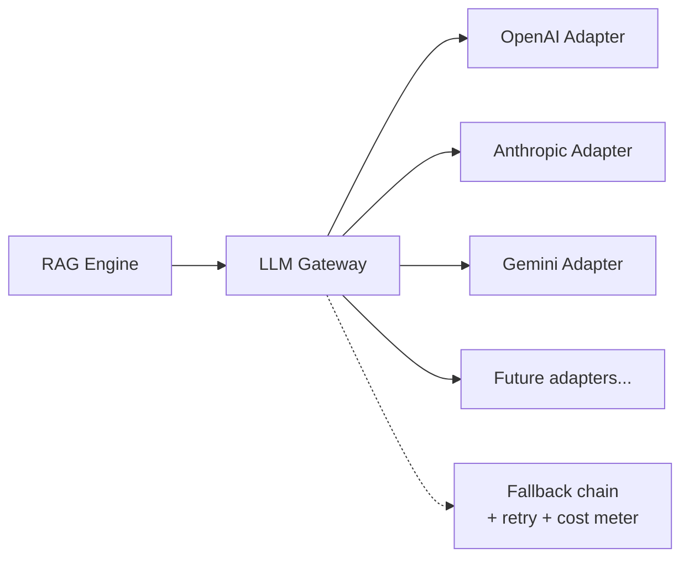

# 05 — Tech Stack: Recommendation & Trade-off Analysis

## সারসংক্ষেপ (বাংলায়)

আমাদের সুপারিশ: **TypeScript Core + Python AI Service** — Next.js (Dashboard ও Widget), NestJS (Core API), FastAPI (AI/RAG Pipeline), Postgres + pgvector, Redis + BullMQ, S3-compatible Object Storage। LLM-এর ক্ষেত্রে নিজস্ব Model নয় — একটি **Model-Agnostic LLM Gateway** (Adapter Pattern), যেখানে OpenAI / Claude / Gemini plug-in হিসেবে যুক্ত হবে। Vector Database শুরুতে pgvector (Postgres-এর ভেতরেই), Scale trigger ছুঁলে Qdrant। Hosting: Singapore region-এ Managed Cloud।

---

## 1. Language Strategy: কেন Hybrid (TS + Python)?

তিনটি option-এর বিশ্লেষণ:

### Option A: Pure TypeScript
- ✅ এক ভাষা — ছোট টিমে সবাই সব জায়গায় কাজ করতে পারে; BD-তে JS developer hiring সবচেয়ে সহজ
- ❌ AI ecosystem-এর সেরা tooling Python-এ: document parsing (table-aware PDF extraction), advanced chunking, reranking, eval framework। TS-এ এগুলো হয় নেই, নয় immature
- ❌ Document parsing-এর মতো CPU-bound কাজ Node-এর event loop-এর জন্য খারাপ fit

### Option B: Pure Python
- ✅ AI tooling শ্রেষ্ঠ
- ❌ Frontend তো TS-ই হবে; পুরো backend Python করলে Dashboard/Widget টিম আর API টিম আলাদা ভাষায় — ছোট টিমে context switching cost
- ❌ BD-তে production-grade Python backend developer pool তুলনামূলক ছোট

### Option C: TypeScript Core + Python AI Service ✅ (সুপারিশ)
- Business logic (Tenancy, Billing, Channels, Conversations) — TS/NestJS: type-safe, hiring-friendly, frontend-এর সাথে shared types
- AI-heavy কাজ (Parsing, Chunking, Embedding, RAG, Eval) — Python/FastAPI: ecosystem advantage যেখানে দরকার ঠিক সেখানে
- দুটি service-এর boundary পরিষ্কার ([02](02-system-architecture.md)) — দুটিই stateless, আলাদা scale হয়
- খরচ: দুটি runtime operate করতে হবে — মেনে নেওয়ার মতো, কারণ boundary মাত্র একটি

---

## 2. Recommended Stack (Layer by Layer)

| Layer | Choice | কেন / Alternatives বাতিল কেন |
|---|---|---|
| Frontend (Dashboard) | **Next.js + TypeScript** | Industry default; SSR + app router; Vercel-independent (self-hostable)। |
| Chat Widget | **Preact/vanilla TS bundle** (আলাদা build) | Customer site-এ embed হবে — bundle size সবচেয়ে গুরুত্বপূর্ণ (<50KB gz টার্গেট)। React full নেওয়া যাবে না। CDN-served। |
| Core API | **NestJS (Node/TS)** | Modular monolith-এর জন্য আদর্শ — module system, DI, guards (RBAC), interceptors (audit log) built-in। Express raw = structure নিজে বানাতে হয়; Fastify adapter ব্যবহার করা যাবে performance-এর জন্য। |
| AI Service | **FastAPI (Python)** | Async, typed (Pydantic), AI ecosystem-এর ঘরের ভাষা। |
| Primary DB | **PostgreSQL 16+** | RLS (isolation-এর ভিত্তি, [03](03-multi-tenancy-security.md)), jsonb (agent config), pgvector — তিনটিই এক engine-এ। MySQL-এ RLS নেই; MongoDB-তে relational integrity + RLS দুটোই হারাতে হয়। |
| Vector Store | **pgvector → Qdrant** (নিচে §4) | |
| Queue | **Redis + BullMQ** | TS-native, retry/backoff/priority built-in, dashboard আছে। Kafka day-1 overkill — operational ভার বেশি, দরকার নেই যতদিন না event volume দাবি করে। Python worker-রা Redis-এর same queue protocol consume করতে পারে। |
| Cache / Session / Rate limit | **Redis** — cache-Redis ও queue-Redis **Day 1 থেকেই আলাদা instance** (queue-তে AOF persistence, cache-এ eviction — দুই স্বভাব এক instance-এ নয়) | Architecture Review সিদ্ধান্ত ([13](13-architecture-review.md) Q3/A1) |
| Object Storage | **S3-compatible** (AWS S3 / Cloudflare R2) | R2-এর egress free — widget asset ও media-র জন্য আকর্ষণীয়। |
| ORM | **Prisma বা Drizzle (TS), SQLAlchemy (Py)** | Migration discipline; RLS-compatible (raw `SET LOCAL` support আছে দুটোতেই)। |
| Auth | **Managed auth provider অথবা self-hosted (যেমন better-auth/Lucia pattern)** + JWT | Email/password + Google OAuth MVP-তে; SAML/OIDC Enterprise phase-এ। Auth নিজে invent করব না। |
| Realtime (inbox, chat) | **WebSocket (Socket.io) / SSE** Redis pub-sub backed | Team Inbox ও widget-এর live reply-র জন্য। |
| Payments | **Stripe (global) + SSLCommerz/bKash (BD)** | দুটোই লাগবে — BD customer-রা local payment চাইবে। Billing module-এ provider abstraction। |
| Observability | **OpenTelemetry + Grafana stack (বা managed: Axiom/Datadog)** | [02](02-system-architecture.md) §6। |
| IaC / CI | **Terraform + GitHub Actions + Docker** | Day 1 থেকে। |

---

## 3. LLM Strategy: Model-Agnostic Gateway

### নীতি

> আমাদের নিজের Model লাগবে না। Platform হবে Model-Agnostic। (BRD)

### Design

- **Internal Gateway, Adapter Pattern** — একটি unified interface: `complete(messages, model_profile, tools?) → response + usage`। বাস্তবায়নে LiteLLM (Python) ভালো শুরুর ভিত্তি — ১০০+ provider আগে থেকেই map করা; চারপাশে আমাদের wrapper থাকবে (cost metering, fallback, logging) যেন LiteLLM-lock-in-ও না হয়।
- **Model Profile per Agent** — Customer চয়ন করবে স্তর, raw model নয়:
  - `economy` — সস্তা/দ্রুত model (যেমন Haiku-class / mini-class) — default, margin রক্ষা করে
  - `standard` — mid-tier
  - `premium` — frontier model (Enterprise/Business plan)
  - ভেতরে কোন প্রকৃত model আছে তা আমরা নিয়ন্ত্রণ করি — দাম বদলালে বা ভালো model এলে customer-এর কিছু না ভেঙে switch।
- **Embedding-ও gateway-র অধীনে** — তবে সাবধান: embedding model বদলালে পুরো re-index লাগে, তাই embedding model version per knowledge-version pinned থাকবে।
- **Fallback chain:** Primary provider 5xx/timeout → secondary provider, same profile tier। Customer টেরও পাবে না।
- **Cost metering:** প্রতিটি call-এ tokens × price → per-org usage ledger → billing + dashboard + budget cap ([03](03-multi-tenancy-security.md) §6.5)।
- **BYO Key (Enterprise):** Customer নিজের OpenAI/Anthropic key দিতে পারবে — encrypted ([03](03-multi-tenancy-security.md) §5); তখন LLM cost তাদের, আমাদের pricing-এ AI cost component বাদ।
- **Bangla quality benchmarking** — কোন model `economy` tier-এ Bangla ভালো পারে তা আমাদের Eval Suite ঠিক করবে ([08](08-differentiators.md)) — এটি আমাদের নীরব প্রতিযোগিতামূলক সুবিধা।

---

## 4. Vector Database Strategy

### সিদ্ধান্ত: pgvector আগে, Qdrant পরে

| | pgvector (শুরু) | Qdrant (scale) |
|---|---|---|
| Operations | শূন্য বাড়তি — Postgres-ই আছে | আলাদা cluster চালাতে হয় |
| Isolation | RLS এমনিতেই কাজ করে ✅ | নিজে namespace/filter enforce করতে হয় |
| Transactionality | Chunk + metadata এক transaction-এ | দুই store sync রাখার ঝামেলা |
| Performance | ~কয়েক কোটি vector পর্যন্ত ভালো (HNSW) | ১০০M+ এও দ্রুত, advanced filtering |
| Cost | শুরুতে $0 | Cluster + ops cost |

**Migration Triggers** (যেকোনো একটি ছুঁলে Qdrant-এ যাব):
1. Vector count > ~৫০M এবং p95 retrieval latency > 200ms (HNSW tuning-এর পরেও)
2. Vector workload Postgres OLTP-র CPU/IO-তে চাপ ফেলছে (একই cluster-এ লড়াই)
3. Advanced retrieval feature দরকার যা pgvector-এ নেই (multi-vector, named vectors)

**Insurance:** AI Service-এ `VectorStore` interface day 1 থেকে — `search(agent_id, query_vector, k, filters)` / `upsert(...)` / `delete(...)`। pgvector আর Qdrant দুটোই এই interface-এর implementation। Migration = dual-write চালিয়ে backfill, তারপর read switch — কোনো downtime নেই।

**Customer কিছুই জানবে না** — BRD অনুযায়ী এটি সম্পূর্ণ platform-managed। Customer শুধু document upload করে।

---

## 5. Hosting Strategy

| ধাপ | Setup | যুক্তি |
|---|---|---|
| MVP | **AWS Singapore (ap-southeast-1)** — ECS/Fargate + RDS Postgres + ElastiCache + S3 (অথবা সমতুল্য GCP) | BD থেকে ~৫০–৭০ms; managed সবকিছু; টিম infra নয় product বানাবে |
| Growth | Auto-scaling, read replicas, আলাদা Redis, CDN (Cloudflare) widget-এর সামনে | |
| Scale / Enterprise | Kubernetes (EKS) যখন multi-service হবে; per-region stack (Terraform module) data residency-র জন্য | |

- **বাংলাদেশে hosting?** Enterprise/Government client BD data residency চাইলে: local provider বা on-prem appliance ভবিষ্যৎ বিবেচনা — Day 1 নয় (managed Postgres/Redis-এর অভাব ops cost বহুগুণ করত)।
- Vercel-এ Dashboard host করা যেতে পারে শুরুতে (গতি), কিন্তু architecture Vercel-dependent হবে না।

---

## 6. যা আমরা ইচ্ছা করে করছি না (এবং কেন)

| লোভনীয় জিনিস | কেন না |
|---|---|
| নিজস্ব LLM fine-tune | RAG + ভালো prompt-এ ৯৫% case মেটে; fine-tune-এর data, খরচ, maintenance এই stage-এ অপচয়। Bangla quality gap হলে আগে eval + prompt + model choice। |
| Kubernetes day 1 | এক টিম, দুই service — Fargate/Cloud Run যথেষ্ট। |
| Kafka day 1 | BullMQ-ই যথেষ্ট; event volume দাবি করলে তখন। |
| Microservices day 1 | [02](02-system-architecture.md) §1। |
| আলাদা Vector DB day 1 | §4। |
| LangChain-জাতীয় heavy framework | Abstraction-এর উপর abstraction; debugging কঠিন। আমরা সরাসরি provider SDK + নিজস্ব পাতলা RAG layer লিখব — control আমাদের হাতে। |
