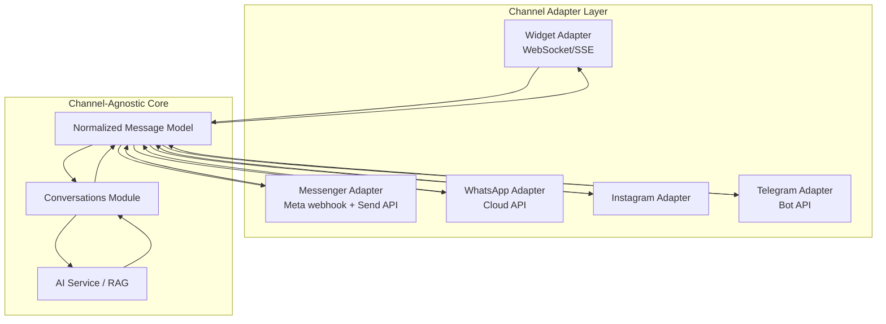
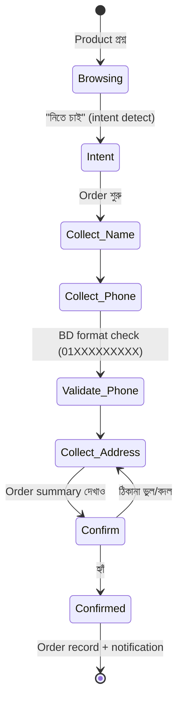

# 06 — Channels & Go-to-Market Strategy

## সারসংক্ষেপ (বাংলায়)

Omnichannel-এর মূল architecture নীতি: **Agent কখনো জানবে না সে কোন চ্যানেলে কথা বলছে** — Core-এর ভেতরে সব message channel-agnostic; প্রতিটি চ্যানেলের জন্য একটি Adapter যা শুধু অনুবাদ করে। Channel priority বিশ্লেষণ করে আমাদের সুপারিশ: **Phase 1 = Website Widget + Facebook Messenger** (বাংলাদেশের SME-রা Facebook-এ, আর Widget সবচেয়ে কম friction-এ global-ready); **Phase 2 = WhatsApp** (BSP cost ও approval জটিলতার কারণে পরে); **Phase 3 = Instagram + Telegram**। সাথে আছে বাংলাদেশের জন্য নকশা করা COD (Cash on Delivery) Order Workflow।

---

## 1. Omnichannel Architecture

### নীতি: One Agent, One Knowledge, Many Channels



### Adapter-এর দায়িত্ব (এবং শুধু এগুলোই)

| Inbound | Outbound |
|---|---|
| Webhook verify (signature) | Channel-এর format-এ উত্তর সাজানো (Messenger quick replies, WhatsApp interactive buttons, Widget rich cards) |
| Channel message → Normalized Message (text, media, location, user identity) | Channel-এর সীমা মানা (message length, rate limit, WhatsApp 24-hour window) |
| End-user identity resolution (PSID/wa_id/visitor_id → platform `end_user`) | Delivery status track + retry |

**Normalized Message Model** — সব চ্যানেলের সর্বনিম্ন সাধারণ রূপ + capability flags:

```text
message:
  conversation_id, end_user_id, direction (in/out),
  content: { type: text|image|file|audio|location|rich, body, attachments[] }
  channel: { type, channel_message_id, capabilities: {buttons, media, typing...} }
```

AI উত্তর তৈরি করে capability-aware renderer দিয়ে — button-supported চ্যানেলে button, না হলে numbered text option। **নতুন চ্যানেল যোগ করা = শুধু একটি নতুন Adapter লেখা** — Core, AI, Knowledge কিছুই ছোঁয়া লাগে না। এটাই BRD-এর omnichannel vision-এর engineering রূপ।

### Cross-channel Identity (Growth phase)

একই customer Messenger-এও আসে, পরে Website-এও — phone/email match হলে `end_user` profile merge → এক customer-এর পূর্ণ ইতিহাস এক জায়গায়। CRM-এর বীজ এখানেই।

---

## 2. Channel Priority: বিশ্লেষণ ও সুপারিশ

### মূল্যায়ন Matrix

| Channel | BD market reach | Integration effort | চলমান খরচ | Approval friction | Global value |
|---|---|---|---|---|---|
| **Website Widget** | মাঝারি (SME-দের website কম) | কম — সম্পূর্ণ নিজেদের নিয়ন্ত্রণে | শূন্য | নেই | ⭐⭐⭐ সর্বোচ্চ |
| **FB Messenger** | ⭐⭐⭐ সর্বোচ্চ — ৮০% SME FB Page-এ ব্যবসা করে | মাঝারি — Meta app review লাগে | শূন্য (Send API free) | মাঝারি (app review একবার) | মাঝারি |
| **WhatsApp** | উচ্চ এবং বাড়ছে | মাঝারি (Cloud API) | **আছে** — per-conversation pricing; business verification | উচ্চ — Meta business verification, display name approval, number লাগবে | উচ্চ |
| Instagram | মাঝারি (F-commerce) | কম (Messenger platform-এই) | শূন্য | Messenger-এর সাথে একই review | মাঝারি |
| Telegram | কম (BD business-এ সীমিত) | **সবচেয়ে কম** (open Bot API) | শূন্য | নেই | কম-মাঝারি |

### সুপারিশ: Phase 1 = Website Widget + Facebook Messenger

যুক্তি:

1. **Widget আগে কারণ এটি আমাদের নিয়ন্ত্রণে** — কোনো third-party approval নেই, demo দেখানো যায় সাইন-আপের ৫ মিনিটে ("paste this script tag")। Activation funnel-এর জন্য অপরিহার্য। এবং এটি global-ready — বিদেশি customer-ও প্রথমে এটাই চাইবে।
2. **Messenger সাথেই, কারণ ওখানেই বাংলাদেশের টাকা** — BRD ঠিকই বলেছে: BD-র SME-দের ৮০% website-ই নেই, Facebook Page-ই দোকান। "আপনার Page-এর inbox এখন AI চালাবে" — এটাই BD-তে আমাদের প্রধান sales pitch। Messenger ছাড়া BD-first strategy অর্থহীন।
3. **WhatsApp ইচ্ছাকৃতভাবে Phase 2** — চাহিদা আছে, কিন্তু: business verification + display name approval + dedicated number + per-conversation Meta fee = onboarding friction ও cost দুটোই বেশি। MVP-র অমূল্য সময় Meta bureaucracy-তে না ঢেলে আগে Widget+Messenger দিয়ে revenue ও case study বানাব। Architecture-এ WhatsApp adapter-এর জায়গা কাটা থাকবে (Messenger-এর সাথে ৭০% শেয়ার করে — দুটোই Meta Graph API)।
4. **Instagram Phase 3-এর শুরুতে** — Messenger adapter-এর সামান্য সম্প্রসারণ; F-commerce segment-এর জন্য। Telegram Phase 3 — সস্তা কিন্তু BD business demand কম; global expansion-এ কাজে লাগবে।

### Channel onboarding UX

- **Widget:** Dashboard → embed snippet copy → paste। Domain allowlist + agent select। (সাথে WordPress plugin — BD-র অনেক site WordPress।)
- **Messenger:** "Connect Facebook Page" OAuth flow → page select → done। আমাদের Meta app একবার review পাশ করলে customer-এর কিছু লাগবে না।
- **WhatsApp (Phase 2):** Embedded signup flow (Meta-র onboarding widget) — friction যতটা সম্ভব আমরা শুষে নেব।

---

## 3. COD (Cash on Delivery) Order Workflow

বাংলাদেশের e-commerce-এর বাস্তবতা: বেশিরভাগ order COD। এটি একটি **guided structured flow** — সাধারণ Q&A নয়:



Design সিদ্ধান্ত:

- **Slot-filling state machine, free-form LLM নয়** — order data (নাম, ফোন, ঠিকানা) সংগ্রহে নির্ভুলতা জরুরি। LLM শুধু extraction ও স্বাভাবিক ভাষায় জিজ্ঞাসা করে; flow নিয়ন্ত্রণ করে deterministic state machine। ভুল phone format হলে আবার জিজ্ঞেস করবে।
- Confirmed order → Dashboard-এর **Orders view** + (Growth) customer-এর system-এ webhook / Google Sheet sync / courier API (Pathao, Steadfast, RedX) — শেষেরটি BD-তে শক্তিশালী differentiator।
- Lead Capture একই engine-এর ছোট রূপ: name + phone → **Leads view** + webhook।
- এই structured flow engine-ই ভবিষ্যৎ **Agent Actions**-এর ভিত্তি ([08](08-differentiators.md)) — আজ form-filling, কাল stock-check ও payment link।

---

## 4. GTM (Go-to-Market) Sequence

| ধাপ | Target | Channel | Pitch |
|---|---|---|---|
| 1 | BD F-commerce ও SME (FB Page-ভিত্তিক) | Messenger | "Page-এর inbox-এ ২৪/৭ AI বিক্রয়কর্মী — Bangla-তে" |
| 2 | BD ছোট-মাঝারি company যাদের website আছে (agency, hospital, school, real estate) | Widget | "Website-এ AI support agent — নিজের document দিয়ে train" |
| 3 | WhatsApp-heavy business (import/wholesale, services) | WhatsApp | Phase 2 launch |
| 4 | Global SMB (English) | Widget প্রথমে | BD-তে প্রমাণিত product + আক্রমণাত্মক pricing |

Pricing reminder (BRD): Agent-count ভিত্তিক — Starter (1) / Growth (5) / Business (20) / Enterprise (unlimited) + প্রতি plan-এ fair-use message/token cap (LLM cost রক্ষাকবচ, [01](01-executive-summary.md) Risk Summary)।
