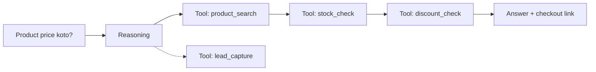

# 08 — Differentiators: যা আমাদের আলাদা করবে

## সারসংক্ষেপ (বাংলায়)

Global competitor-রা (Intercom Fin, Chatbase, Voiceflow, Tidio) generic chatbot সমস্যা সমাধান করছে — কিন্তু তাদের কেউই **Bangla-native নয়, Facebook-commerce-native নয়, COD-native নয়**। আমাদের কৌশল: এই তিনটি দিয়ে বাংলাদেশ (ও পরে অনুরূপ বাজার — দক্ষিণ এশিয়া, দক্ষিণ-পূর্ব এশিয়া) জিতে নেওয়া, এবং একই সাথে Smart Retraining + Learning Loop + Agent Actions দিয়ে global মানেও এগিয়ে থাকা। প্রতিটি differentiator-এর সাথে তার engineering ভিত্তি কোথায় ডিজাইন করা আছে তা উল্লেখ করা হলো।

---

## 1. Competitor Mapping

| | Intercom Fin | Chatbase | Voiceflow | Tidio | **আমরা** |
|---|---|---|---|---|---|
| Category | Support automation (enterprise) | KB chatbot builder | Conversation design platform | SMB live chat + bot | **Multi-agent AI Workforce** |
| Multi-agent per org | আংশিক | দুর্বল | Flow-ভিত্তিক | না | ✅ Core model (Org→WS→Agents) |
| Bangla quality | দুর্বল-মাঝারি | দুর্বল | নিজে বানাতে হয় | দুর্বল | ✅ **Native (eval-driven)** |
| FB Messenger commerce | সীমিত | না | integration লাগে | আছে কিন্তু generic | ✅ **FB-first, COD-native** |
| Learning loop (unknown→learn) | আছে (দামি tier) | নেই | নিজে বানাতে হয় | সীমিত | ✅ সব tier-এ core |
| Smart retraining | আংশিক | re-upload manual | — | — | ✅ Hash-diff auto |
| Pricing | খুব দামি (per-resolution) | message-based | seat-based | seat+message | **Agent-count — সহজ, predictable** |
| Local payment (bKash/SSLCommerz) | না | না | না | না | ✅ |

**মূল insight:** Global player-দের জন্য বাংলাদেশ rounding error — তারা এখানে localize করবে না। আর local competitor-রা সাধারণত rule-based bot বানায়, "Agent" নয়। মাঝের এই ফাঁকা জায়গাটাই আমাদের।

---

## 2. Bangla-Native AI

**সমস্যা:** Frontier model-গুলো Bangla পারে, কিন্তু মান অসমান — বানান, সম্মানসূচক রূপ (আপনি/তুমি), Banglish (bangla in latin letters), আঞ্চলিক বাক্যরীতি, এবং সবচেয়ে কঠিন: **mixed-language conversation** ("bhai eta ki stock e ache?")।

**আমাদের approach (engineering ভিত্তি: [05](05-tech-stack.md) §3 Eval, [04](04-agent-lifecycle.md)):**

1. **Bangla Eval Suite** — আমাদের গোপন অস্ত্র। বাস্তব BD customer conversation-এর ধাঁচে test set: শুদ্ধ বাংলা, Banglish, mixed, ভুল বানান, voice-transcribed। প্রতিটি model/prompt পরিবর্তন এই suite-এর বিরুদ্ধে scored। কোনো competitor এটা বানাতে আমাদের data ছাড়া পারবে না — যত customer, তত ভালো eval, তত ভালো product (data moat)।
2. **Bangla-aware RAG** — Embedding model বাছাই Bangla retrieval benchmark দিয়ে; প্রয়োজনে query normalization (Banglish → Bangla) retrieval-এর আগে।
3. **Persona-level ভাষা নিয়ন্ত্রণ** — Agent config-এ: ভাষা (Bangla/English/auto-match), tone-এ আপনি/তুমি নির্বাচন, brand glossary (পণ্যের নাম যেভাবে লিখতে হবে)।
4. Fine-tuning নয় (এখন) — eval + prompt + model choice আগে; gap থাকলে তখন বিবেচনা ([05](05-tech-stack.md) §6)।

---

## 3. Bangla Voice Agent (Phase 2)

BD user-রা type-এর চেয়ে voice message পাঠাতে স্বাচ্ছন্দ্যবোধ করে — Messenger/WhatsApp-এ voice note সংস্কৃতির অংশ।

**Pipeline:** Voice note in → **STT** (Bangla-capable: Whisper-class বা Google STT — eval দিয়ে বাছাই) → স্বাভাবিক RAG pipeline → text উত্তর + ঐচ্ছিক **TTS** voice reply।

- Architecture-গত ভাবে এটি শুধু Normalized Message Model-এ ([06](06-channels-gtm.md)) `audio` content type + AI Service-এ STT/TTS step — নতুন কোনো system নয়।
- Cost guard: voice processing premium plan feature অথবা metered।
- Differentiator মূল্য: **এই বাজারে কেউ Bangla voice commerce bot দিচ্ছে না।**

---

## 4. Facebook-Centric Commerce + COD

বিস্তারিত design [06-channels-gtm.md](06-channels-gtm.md)-এ; differentiator হিসেবে সারমর্ম:

- BD-র ৮০% SME-র "দোকান" = FB Page → আমাদের onboarding pitch: **"আপনার Page-এর inbox এখন AI বিক্রয়কর্মী"**
- COD slot-filling state machine (নাম → ফোন → ঠিকানা → confirm) — deterministic, নির্ভুল
- Courier integration (Pathao/Steadfast/RedX) — order confirm থেকে booking পর্যন্ত এক প্রবাহ — global tool-গুলোর কাছে এটি অকল্পনীয় localization
- bKash/SSLCommerz দিয়ে subscription bill — customer-এর নিজের ভাষায় টাকা দেওয়ার পথ

---

## 5. Smart Retraining + Learning Loop (Global-grade core)

এ দুটি BD-specific নয় — global মানেও শক্তিশালী selling point:

- **Smart Retraining** ([04](04-agent-lifecycle.md) §4): নতুন PDF দিলে hash-diff → শুধু বদলানো অংশ re-index → zero-downtime version flip → এক-ক্লিক rollback। Competitor-দের অনেকে এখনও "delete & re-upload"।
- **Learning Loop** ([04](04-agent-lifecycle.md) §7): unknown question → semantic cluster ("৪৭ জন এটা জিজ্ঞেস করেছে") → admin এক উত্তর দিলে Agent শিখে যায়। এটি product-এর সবচেয়ে sticky feature — admin যত উত্তর দেয়, switching cost তত বাড়ে।
- **Citation-backed answers** ([04](04-agent-lifecycle.md) §3): "Source: pricelist.pdf, page 4" — trust feature, enterprise-এ অপরিহার্য।

---

## 6. Agent Actions: Question → Reasoning → Action → Answer (Phase 3)

BRD-এর দীর্ঘমেয়াদী স্বপ্ন — এবং প্রকৃত category-পরিবর্তনকারী:

**Engineering ভিত্তি আগে থেকেই পাতা:**

- LLM Gateway interface-এ `tools` parameter day 1 থেকে ([05](05-tech-stack.md) §3)
- COD state machine = প্রথম "action" — Phase 3-এ একই engine generalize হয়
- Security model আগে থেকে নির্ধারিত: tool **allowlist per agent**, model নিজে capability পায় না ([03](03-multi-tenancy-security.md) §6)
- Tool প্রকার: **built-in** (order, lead, calendar, handoff) + **HTTP tool** (customer-এর API, with auth config) + **marketplace tools** (ভবিষ্যৎ)

---

## 7. Agent Marketplace (Phase 3)

- Prebuilt vertical agents: Ecommerce, Hospital, School, Law Firm, HR, VAT consultant — template (persona + knowledge schema + suggested tools) এক-ক্লিক deploy
- কৌশলগত মূল্য: onboarding time কমায় + vertical SEO/marketing হাতল + পরে third-party ecosystem (revenue share)
- Engineering-গত ভাবে সস্তা: Phase 0-র Agent Template ব্যবস্থারই public রূপ ([04](04-agent-lifecycle.md) §2)

---

## 8. Defensibility সারমর্ম (Moat Stack)

| স্তর | Moat | শক্তি বাড়ে যখন |
|---|---|---|
| 1 | Bangla Eval Suite + data | প্রতিটি conversation-এ |
| 2 | Learning Loop-এ admin-দের শ্রম (switching cost) | প্রতিটি answered question-এ |
| 3 | Local integration জাল (bKash, courier, SSLCommerz) | প্রতিটি integration-এ |
| 4 | Agent-count pricing-এর সরলতা | competitor-রা complex pricing-এ আটকে |
| 5 | Marketplace network effect (ভবিষ্যৎ) | প্রতিটি template ও third-party-তে |

> **এক লাইনে:** Global player-রা আসবে না, local player-রা পারবে না — আর আমরা যত দিন চালাব, data ও integration moat তত গভীর হবে।
