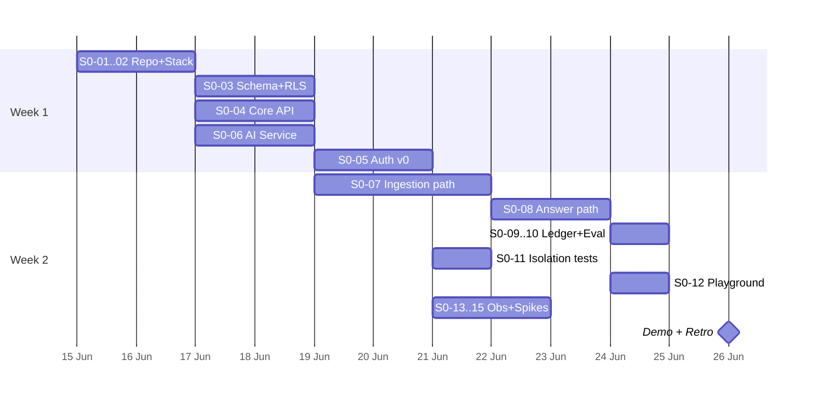

# 14 — Sprint 0 Plan (২ সপ্তাহ)

## সারসংক্ষেপ (বাংলায়)

Sprint 0-র একটাই লক্ষ্য: **Walking Skeleton** — পুরো ব্যবস্থার সবচেয়ে পাতলা end-to-end পথ চালু করা ([07](07-roadmap.md) cross-phase নীতি #1)। Feature নয়, প্রমাণ: প্রতিটি architectural সিদ্ধান্ত (RLS, queue, gateway, pgvector) কোডে জীবন্ত এবং একসাথে কাজ করে। Sprint শেষে demo: `docker compose up` → seed org → PDF upload → training → প্রশ্ন → **grounded উত্তর + citation** — সরু, কুৎসিত, কিন্তু সত্যি।

> **Sprint 0-তে UI polish, multi-channel, billing UI — কিছুই নেই।** ওগুলো Phase 0-র পরের sprint-গুলোর কাজ ([09](09-product-requirements.md) scope-এর ভেতরে)।

---

## 1. Definition of Done (Sprint 0)

1. `docker compose up` + `pnpm install` + migration → local stack চালু (নতুন developer-এর onboarding < ৩০ মিনিট)
2. API দিয়ে: org create → agent create → PDF upload → ingestion pipeline (parse → chunk → hash → embed → index) সম্পূর্ণ হয়
3. `/v1/answer` দিয়ে প্রশ্ন করলে: retrieval → LLM → উত্তর + citation; knowledge-র বাইরের প্রশ্নে honest "জানি না"
4. **Cross-tenant isolation test pass** — Tenant A-র token-এ Tenant B-র data ছোঁয়া যায় না (RLS প্রমাণিত)
5. প্রতিটি LLM call-এর token usage `usage_ledger`-এ recorded (F10.5 v0)
6. CI: lint + test + RLS-coverage check সবুজ
7. দুটি spike report কমিটেড: A2 (pgvector+filter benchmark), A3 (RLS+pooling overhead)

---

## 2. Ticket Breakdown

Owner role গুলো [07](07-roadmap.md) Phase 0 টিম অনুযায়ী: **FSL** (Full-stack lead), **BE** (Backend TS), **AI** (AI engineer Py), **FE** (Frontend), **PM** (Founder/PM)। Estimate-গুলো ideal-day।

### Track A — Foundation (সপ্তাহ ১)

| ID | Ticket | Maps to | Owner | Est | এই scaffold-এ |
|---|---|---|---|---|---|
| S0-01 | Monorepo + pnpm workspaces + lint/format/CI skeleton | [05](05-tech-stack.md) | FSL | 1d | ✅ scaffolded |
| S0-02 | docker-compose local stack: Postgres+pgvector, **redis-cache + redis-queue আলাদা (A1)**, MinIO | [13](13-architecture-review.md) A1 | FSL | 0.5d | ✅ scaffolded |
| S0-03 | DB schema v0 + **RLS policies** + migration runner + CI check: RLS-হীন tenant table = fail | [03](03-multi-tenancy-security.md) §2 | BE | 2d | ✅ migration 0001 |
| S0-04 | Core API skeleton: NestJS modular monolith (module boundary = [02](02-system-architecture.md) §2), tenant-context (`SET LOCAL`) interceptor, health | [02](02-system-architecture.md) | BE | 2d | ✅ skeleton |
| S0-05 | Auth v0: email+password → JWT (org auto-create) — F1-এর সরুতম রূপ; Google OAuth পরে | [09](09-product-requirements.md) F1 | FSL | 2d | stub |

### Track B — AI Path (সপ্তাহ ১–২)

| ID | Ticket | Maps to | Owner | Est | এই scaffold-এ |
|---|---|---|---|---|---|
| S0-06 | AI Service skeleton: FastAPI + `VectorStore` interface (+pgvector impl) + **LLM Gateway** (profile→model map, usage capture) | [05](05-tech-stack.md) §3–4 | AI | 2d | ✅ skeleton |
| S0-07 | Ingestion walking path: upload → MinIO → BullMQ job → parse (PDF, basic) → chunk → content-hash → embed → index। Happy path; layout-aware parsing পরের sprint | [04](04-agent-lifecycle.md) §3 | AI | 3d | pipeline stub |
| S0-08 | Answer walking path: question → retrieve (agent-scoped) → prompt assembly (cacheable prefix!) → LLM → answer + citation; low-retrieval হলে UNKNOWN + log | [04](04-agent-lifecycle.md) §6 | AI | 2d | stub |
| S0-09 | Cost ledger v0: প্রতি LLM call → `usage_ledger` row (provider-reported tokens) | [10](10-pricing-unit-economics.md), F10.5 | BE | 1d | table ✅ |
| S0-10 | Eval smoke: golden dataset-এর প্রথম ১০ প্রশ্ন + script (gate পরে; এখন report-only) | [11](11-evaluation-framework.md) | AI | 1d | — |

### Track C — Proof & Risk (সপ্তাহ ২)

| ID | Ticket | Maps to | Owner | Est |
|---|---|---|---|---|
| S0-11 | Cross-tenant isolation test suite v0 (CI-তে) | [03](03-multi-tenancy-security.md) §2.3 | BE | 1d |
| S0-12 | Playground সরুতম রূপ: web app-এ একটি পাতা — question box → `/v1/answer` → উত্তর+citation (অথবা প্রথম দিনগুলোতে curl script) | F5 | FE | 1.5d |
| S0-13 | Observability v0: structured JSON log + `trace_id` propagation (web→api→ai→llm) | [12](12-observability-monitoring.md) | FSL | 1d |
| S0-14 | **Spike A2:** pgvector + `agent_id` filter benchmark (১M synthetic vectors) — report কমিট | [13](13-architecture-review.md) A2 | AI | 1d (timeboxed) |
| S0-15 | **Spike A3:** RLS + PgBouncer transaction-mode overhead benchmark — report কমিট | [13](13-architecture-review.md) A3 | BE | 1d (timeboxed) |
| S0-16 | Meta developer app তৈরি + review submission প্রস্তুতি (A4) — কোড নয়, কাগজপত্র | [09](09-product-requirements.md) F7.5 | PM | চলমান |
| S0-17 | Gateway-bypass lint rule (A6): provider SDK সরাসরি import নিষেধ, gateway ছাড়া | [13](13-architecture-review.md) A6 | AI | 0.5d |

### Sequencing



S0-16 (Meta) sprint-জুড়ে সমান্তরাল — **এটি critical path-এ না থাকলেও calendar-এ সবচেয়ে লম্বা lead time।**

---

## 3. Walking Skeleton-এর সংজ্ঞা (কী "যথেষ্ট সরু")

| অংশ | Sprint 0-তে যা | যা **নয়** (পরের sprint) |
|---|---|---|
| Auth | Email+password, JWT, org auto-create | Google OAuth, invite, verification email |
| Upload | API endpoint + MinIO | Dashboard upload UI, progress bar |
| Parsing | বেসিক PDF text extraction | Layout-aware/table parsing (F3.2), scanned-PDF reject |
| Retraining | Content-hash কলামসহ schema; diff-skip logic | Version UI, rollback button |
| Answer | RAG + citation + UNKNOWN fallback | Persona tuning, confidence threshold config |
| Channel | কিছুই না — শুধু playground/API | Widget, Messenger (পরের sprint-এর মূল কাজ) |
| Billing | usage_ledger row লেখা | Cap enforcement, plans (F10.1–F10.4) |

---

## 4. Scaffold ↔ Ticket সম্পর্ক

এই repo-তে এখন যা scaffolded আছে তা ticket-গুলোর **শুরুর অবস্থা**, সমাপ্তি নয়। প্রতিটি stub ফাইলে `TODO(S0-xx)` মন্তব্য আছে — ticket ধরে খুঁজে নেওয়া যাবে:

```text
apps/api/        → S0-04, S0-05, S0-09, S0-11   (NestJS Core API)
apps/web/        → S0-12                        (Next.js dashboard + playground)
services/ai/     → S0-06, S0-07, S0-08, S0-17   (FastAPI AI Service)
packages/shared/ → Normalized Message model, plan config types
db/migrations/   → S0-03                        (schema + RLS)
docker-compose.yml → S0-02                      (A1: দুই Redis embodied)
ops/runbooks/    → S0-13 সংলগ্ন                  (RB stubs)
infra/terraform/ → Phase 0 শেষদিকে (deploy)      (placeholder)
```

---

## 5. Sprint Ritual

- **Daily:** ১০-মিনিট standup; blocker > আলোচনা।
- **Demo (শেষ দিন):** §1-এর DoD ধরে ধরে লাইভ — golden path script চালিয়ে।
- **Retro:** spike report দুটি (A2, A3) পড়ে [13](13-architecture-review.md)-এর সংশ্লিষ্ট রায় নিশ্চিত/সংশোধন — সংশোধন লাগলে doc PR (Plan Lock নিয়ম মেনে)।
